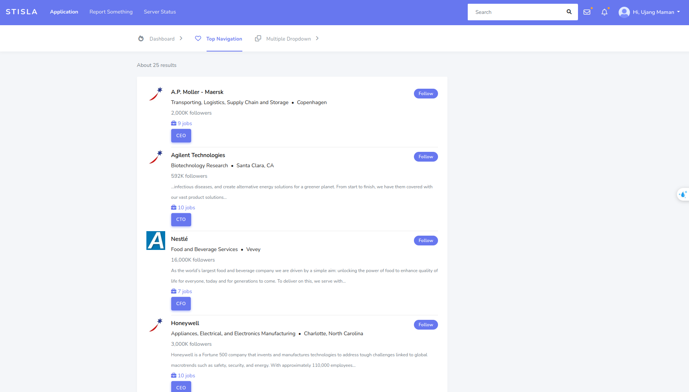
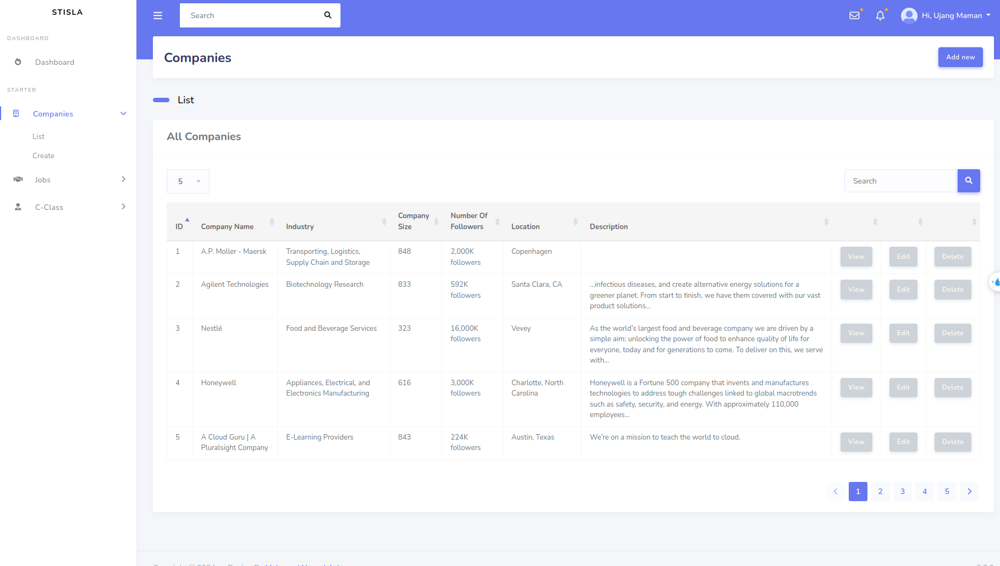

## Quick start

```bash
$ make install

# or...

$ echo "UID=$(id -u)" >> .env # Linux environment only
$ echo "GID=$(id -g)" >> .env # Linux environment only

$ docker compose build
$ docker compose up -d
$ docker compose exec app composer install
$ docker compose exec app cp .env.example .env
$ docker compose exec app php artisan key:generate
$ docker compose exec app php artisan storage:link
$ docker compose exec app chmod -R 777 storage bootstrap/cache

#seed data
$ make seed
$ make seed-logo-image

```
Test task: http://localhost 
<p align="center">
  
</p>
<p align="center">
  
</p>

Admin test task: http://localhost/admin/company
<p align="center">
  
</p>
